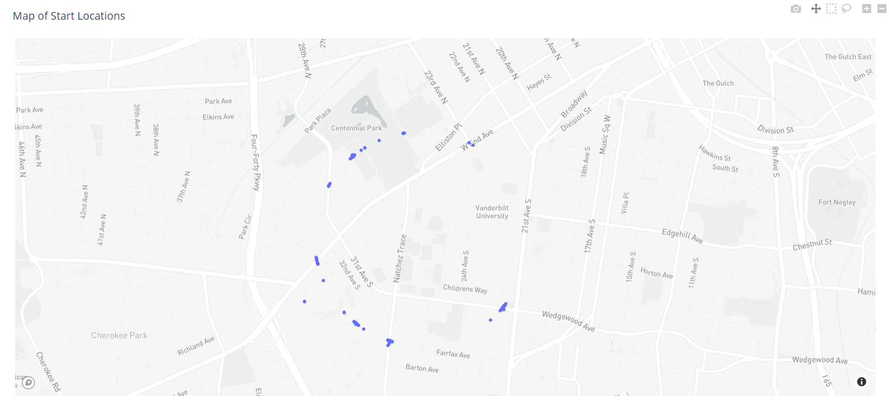
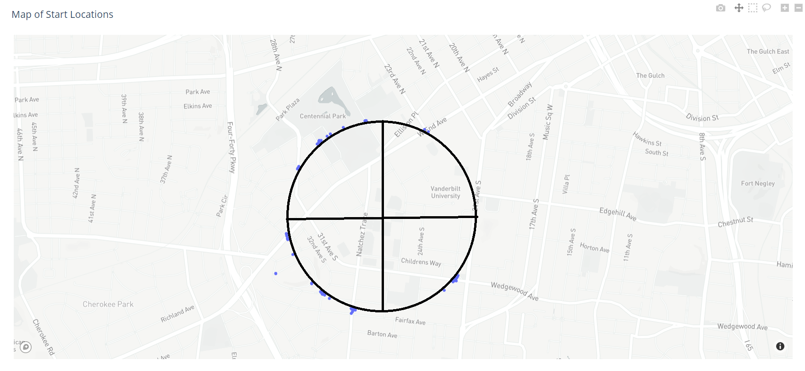

# Strava Data Tools

Data tools created to investigate how much information is gleanable from Strava. Investigating results from our [survey](https://docs.google.com/forms/d/e/1FAIpQLSeGa4oRXdG83JrqNwLlDvE6D1b9JQJP_lmYOSlNpiCFFuiWWw/viewform?usp=sf_link) on sentiment and understanding of Privacy in social media spaces related to fitness.

Contains functions to manipulate, visualize, and analyze GPS Data from a Strava Data Dump.

Strava contains Privacy Features to help users hide addresses associated with them (such as home or office addresses), while still being able to participate in sharing routes and interesting activities. While disabling maps on activities prevents any chance of leaked location information, it undermines much of the purpose of fitness applications like Strava, the ability to compete on shared segments, share routes with friends, and post accomplishments.

One notable feature intended to alleviate this concern is the Privacy Zone. This disables location sharing around a certain radius of a marked location. Unfortunately, given enough data, this feature can be easily defeated.

#Example of Mapped Start Locations


#Example of Start Locations with a Privacy Zone



#Determining the Center of a Privacy Zone



Requires plotly, fitparse, numpy, and pandas.

To extract the compressed activity files, use ```python 3 ./strava_extract.py -e``` NOTE that due that some functions involved still use relative paths, so running this from within the working directory containing the data provided by Strava is REQUIRED (I know that's bad, on the TODO list for fixes.)

To extract only the start points from a folder of activity files, use ```python3 ./strava_extract.py``` without the ```-e``` flag. This will not extract .FIT files, only read from them. The optional ```-p``` parameters allows you to load in a .CSV file containing privacy zones, but this requires a google maps token, the file location of which is accessed with the ```-g``` flag.

To display the processed points on an interactive map use ```./strava_map.py -i <input_file.csv>```, which is a CSV file containing coordinates to starting points of activities (optionally considering privacy zones). You can configure certain maps to overlay onto. The default map requires a MapBox token. If no such token is available, use ```-l open-street-map``` as your layer.

Note: As [MapBox](https://www.mapbox.com/) is required for certain visualizations, a mapbox token will be required for these functions.

Note: A [Google Maps](https://github.com/googlemaps/google-maps-services-python) API token is also required to analyze privacy zones. Strava stores Privacy Zones using text addresses, so we send those to Google Maps to receive coordinates.
